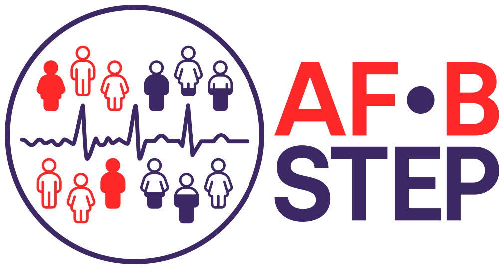
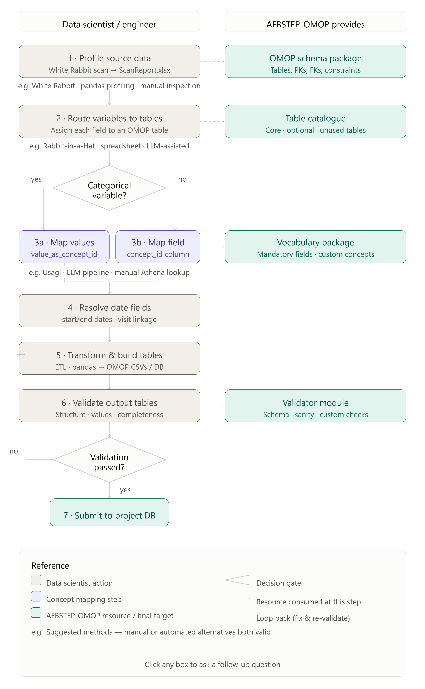

 

---


# AFBSTEP-OMOP

This package defines how OMOP is used to integrate clinical study data within the AF-B-STEP consortium. It contains the specifications of the database schema, descriptions, examples and a validation pipeline. AF-B-STEP has introduced minor extensions to OMOP as **AFBSTEP-OMOP** which include custom concepts, additional tables, and best practices, but has not modified the original structure.

This package helps to understand the requirements when transforming clinical study data to AF-B-STEP OMOP and how to verify that what has been produced is compliant with the AFBSTEP-OMOP specifications.

## Installation

afbstep-omop is a regular Python package. It can - for instance - be installed using `uv`, but also using any other Python package manager.

If using `uv`, install it according to the [official documentaion](https://docs.astral.sh/uv/getting-started/installation/), e.g.
```bash
curl -LsSf https://astral.sh/uv/install.sh | sh
```
Then install the dependancies in a virtual environment:
```
uv sync
```

The default installation has no dependencies (only python's stdlib). To run the notebook example (see below), you will need to also install some addiation dependencies:
```
uv sync --group example_pipeline
```

## Forewords

### What is AFBSTEP

AF-B-STEP is an international research consortium which brings together academic and industry partners, patient groups, and payors to improve diagnosis and treatment of atrial fibrillation (AF). **AFBOLD** is an individual-patient data meta-analysis conducted within AF-B-STEP, a large data science effort bringing together data from 100,000+ individuals to estimate the association of AF burden and patient outcomes. AF-B-STEP will also establish standards for how medical devices and consumer wearables should measure and report AF (burden).

Official website: https://afbstep.eu/

### What is OMOP

The Observational Medical Outcomes Partnership (OMOP) Common Data Model (CDM) is an open community data standard, designed to standardize the structure and content of observational data and to enable efficient analyses that can produce reliable evidence.

It provides a structured relational database schema (a collection of tables with pre-specified columns and constraints) onto which (almost) any kind of clinical data set can be mapped. In addition, it provides a standard vocabulary registry (Athena) that gives (almost) every clinical meaning a standardised concept.

Official website: https://www.ohdsi.org/data-standardization/ \
Common data model: https://ohdsi.github.io/CommonDataModel/ \
Standardized vocabulary: https://athena.ohdsi.org/vocabulary/list

#### Why is it good for ?

Even if two clinical data sets are storing the same information, the structure, naming and convention are likely to diverge. OMOP as a structual schema in combination with its controlled vocabulatory allows both data sets to be mapped, stored, and analysed using the same data structure.

For example, take two sites recording the same two facts for the same two patients: a blood pressure reading and an atrial fibrillation diagnosis.

Site A keeps everything in one long-format table:

| patient_id | visit_date |	variable |	value |
| ---   | ---        | ---           | --- |
| P-001 |	2024-03-12 |	sbp          |	138
| P-001 |	2024-03-12 |	dbp          |	84 
| P-001 |	2024-03-12 |	af_diagnosis |	1
| P-002 |	2024-05-02 |	sbp          |	121
| P-002 |	2024-05-02 |	dbp          |	79
| P-002 |	2024-05-02 |	af_diagnosis |	0

Site B keeps two wide-format tables:

**vitals**:
| subject |	exam_dt    |	systolic_mmhg |	diastolic_mmhg |
| --- |	---    |	--- |	--- |
| 1001	  | 12/03/2024 |	138	          | 84 |
| 1002    |	02/05/2024 |	121	          | 79 |

**medical history**
| subject |	exam_dt |	afib_yn |
| --- | --- | --- |
| 1001 |	12/03/2024 |	Y
| 1002 |	02/05/2024 |	N

Except for the medical information contained, almost nothing about these two data structures is the same. The patient identifiers differ, the dates are ISO at one site and DD/MM/YYYY at the other, the source variable names differ, yes/no is 1/0 at one site and Y/N at the other, and a fact that is a row at Site A is a column at Site B. Neither is wrong, they are two reasonable choices, and a query written against one returns nothing against the other.

Mapped into AFBSTEP-OMOP, both produce the same rows:

**person**
| person_id | person_source_value | … |
| --- | --- | --- |
| 1 | P-001 | *(demographic fields omitted)* |
| 2 | P-002 | |

**measurement**
| measurement_id |	person_id |	measurement_concept_id |	measurement_date |	value_as_number |	unit_concept_id |	measurement_source_value |
| --- | --- | --- | --- | --- | --- | --- |
| 1	| 1 |	3004249 |	2024-03-12 |	138 |	8876 |	sbp |
| 2	| 1	| 3012888	| 2024-03-12 |	84  |	8876 |	dbp |
| 3	| 2	| 3004249	| 2024-05-02 |	121 |	8876 |	sbp |
| 4	| 2	| 3012888	| 2024-05-02 |	79  |	8876 |	dbp |

**condition_occurrence**
| condition_occurrence_id |	person_id |	condition_concept_id |	condition_start_date |	condition_source_value |
| --- | --- | --- | --- | --- |
| 1 |	1 |	313217 |	2024-03-12 |	af_diagnosis=1 |

`3004249` is [systolic blood pressure](https://athena.ohdsi.org/search-terms/terms?query=3004249&boosts&page=1), `3012888` [diastolic](https://athena.ohdsi.org/search-terms/terms?query=3012888&boosts&page=1), `8876` the [unit mmHg](https://athena.ohdsi.org/search-terms/terms?query=8876&boosts&page=1), and `313217` [atrial fibrillation](https://athena.ohdsi.org/search-terms/terms?query=313217&boosts&page=1). All four are pinned in this package's registry, so both sites resolve them offline to exactly the same concepts.

Two things worth noticing:

1. The same clinical fact now carries the same `concept_id` at both sites. An analysis written once runs against both, which is the entire point of a common model.
2. The site's own value survives in `*_source_value`. Site A's `sbp` and Site B's `systolic_mmhg` both land in `measurement_concept_id = 3004249`, but each row still records what it came from, so a mapping decision can be audited, questioned, or corrected later without going back to the source system.

> Note also that Site B's `afib_yn = N` for patient 1002 produces no row at all, not a row saying "no". **Absence is meaningful in OMOP and is modelled deliberately, see Step 1.**


#### Terminology

OMOP has precise names for things that are easy to blur together, and the rest of this document uses them strictly.

| Term | Means | Example |
|---|---|---|
| **source variable** | a column in *your* dataset | `sbp`, `afib_yn`, `exam_dt` |
| **CDM table** | a table in the target model | `measurement` |
| **CDM field** | a column in a CDM table | `value_as_number` |
| **concept** | a standardised *meaning*, identified by a `concept_id` | `3004249` = systolic blood pressure |
| **concept field** | a CDM field that holds a `concept_id` | `measurement_concept_id` |
| **source value** | your original code, preserved next to the concept | `measurement_source_value = "sbp"` |

Source variables live in your data, concepts live in the vocabulary, and fields live in the CDM. A concept is never a column, and a source variable is never a concept.

This is why "map a variable to a concept" is too coarse a description of the work. The single Site A row `P-001 | 2024-03-12 | sbp | 138` becomes five separate things:

| From the source | Becomes | In the CDM |
|---|---|---|
| the source variable `sbp` exists | a row | in table `measurement` |
| what `sbp` *means* | concept `3004249` | in field `measurement_concept_id` |
| the number `138` | `138` | in field `value_as_number` |
| the implied unit | concept `8876` | in field `unit_concept_id` |
| the name `sbp` itself | `"sbp"` | in field `measurement_source_value` |

Mapping one source variable therefore answers three questions: **which table**, **which concept identifies it**, and **which field carries its value**.

One further distinction, because both are called "concept" and they do opposite jobs:

- a **question concept** says what a row is *about*: `measurement_concept_id`, `condition_concept_id`, `observation_concept_id`
- an **answer concept** is a categorical *result*: `value_as_concept_id`

`3004249` ([systolic blood pressure](https://athena.ohdsi.org/search-terms/terms?query=3004249)) is a question; `4154290` ([paroxysmal atrial fibrillation](https://athena.ohdsi.org/search-terms/terms?query=4154290&boosts&page=1)) is an answer.

## What is AFBSTEP-OMOP ?

AFBSTEP-OMOP relies on the OMOP model but extends its model and registry with additional tables and concepts relevant to the storage of cardiac monitoring data. It also restricts and frames the OMOP model to fit the need of the AFBSTEP project.

It defines:
- a minimal set of CDM tables to be transfered with AF-B-STEP data sets
- a minimal set of CDM fields, and the concepts they must carry
- pinned OHDSI concepts for standard clinical meanings
- custom concepts for meanings the OHDSI registry does not cover
- best practices on how to store AF burden / cardiac monitoring data within the OMOP CDM

### What is different from stock OMOP

AFBSTEP-OMOP is a **profile** of OMOP CDM, not a fork. Nothing in the stock schema is modified: every standard table, field and constraint is kept exactly as OHDSI defines it, so generic OHDSI tooling (Atlas, the Data Quality Dashboard, Achilles) keeps working on an AFBSTEP-OMOP data set. The differences are of two kinds: 
1. **additions** for what OMOP does not have
2. **restrictions** where OMOP leaves a choice open and AFBSTEP pins it down.

| Aspect | Stock OMOP CDM | AFBSTEP-OMOP |
|---|---|---|
| Schema | 39 standard tables | unchanged, plus **5 companion tables**: `study`, `study_attribute`, `person_study`, `device_specs`, `source` |
| Vocabulary | the full Athena registry, typically resolved online | a **pinned registry** of standard concepts that resolves offline and reproducibly, plus **custom AFBSTEP concepts** (`2000000000+` range) for meanings Athena does not cover |
| Concept → table routing | a concept's `domain_id` determines its table | the registry names the target table explicitly; 23 concepts deliberately deviate from the domain convention (see Step 2) |
| Table scope | any table may be used, none is enforced | tables are tiered **mandatory / expected / optional**; everything else is out of scope |
| Field requirements | the DDL's `NOT NULL` constraints | additionally a **minimal data set** of fields that must be populated even where the DDL allows `NULL` — stricter than the CDM, never looser |
| Cardiac monitoring data | no prescribed pattern | an **episode-anchored model** for detected rhythm episodes and aggregated burden windows (see "Storing cardiac monitoring data" section in `mapping_guideline/mapping_codebook.md`) |

The four companion tables exist because AFBOLD is a meta-analysis of monitoring data: cross-study pooling needs study provenance, an AF-burden value is only interpretable together with the device and algorithm that produced it, and the underlying recordings must remain findable for re-analysis.

| Table | One row per | Purpose |
|---|---|---|
| `study` | contributing study | Describes a source study: name, NCT number, sponsor, phase, start and end dates. |
| `person_study` | person per study | Links a person to the study they were enrolled in, including the enrolment date. |
| `device_specs` | episode | The device behind a monitoring episode: device concept, manufacturer/model, serial number, and the rhythm-detection **algorithm with its version**. |
| `source` | external file reference | Points a row — typically an episode — to an externally stored raw file (CIED remote-monitoring report, Holter/ECG waveform, scanned document or letter) without storing binary content inside the CDM. |

The companion tables are strictly additive: they reference the standard tables (`person_id`, `episode_id`), no standard table references them, and a stock-OMOP consumer can ignore them entirely.

## Mapping your tabular standard data to the AFBSTEP-OMOP model 

Mapping the source data is, in general, not an easy task, and there is no universal way to automate the process.
The AFBSTEP-OMOP package provides:
- a description of the target database schema
- a registry of the concepts AFBSTEP expects, both standard and custom
- a guidleine and examples
- a validation function
- a mock data generator

Extended documentation, helpers and examples are provided in the `mapping_guideline/` directory.
- A full example is given in the `guideline/example` directory, which contains an initial data set, a notebook with the 6 steps described below and a final, mapped and validated AFBSTEP-OMOP conform data set.
- A `mapping_cookbook.md` file that describes the mapping pipeline for several typical clinical source data set (baseline table, cardiac monitoring, followup table, etc.)

In general, the transformation/mapping process from your source data set to a AFBSTEP-OMOP conform data set can be seprated into 6 steps

1. Frame and scope
2. Route source variable to CDM tables
3. Map source variable to concept ids
4. Resolve date fields
5. Transform and build tables
6. validate

Here are some functionalities, provided by the package, to help you through the process:

Generate AFBSTEP-OMOP conform mock data (as example for a possible output data set)
```python
from afbstepomop.source_validator import load_spec, load_vocabulary, load_structural
from afbstepomop.mockdata import generate_dataset

schema = load_structural()
spec = load_spec()
vocabulary = load_vocabulary()
mock_data = generate_dataset(50, "output/file/path", seed=0, schema=schema, spec=spec, vocabulary=vocabulary)
```
`mock_data` is a dictionary containing each expected CMD table as dict value.
To display one table `pd.DataFrame(mock_data["person"])`.


List the CDM tables and their tiers (mandatory, optional, expected)
```python
from afbstepomop.source_validator import describe, load_spec

print(describe(load_spec()))
```
For each, `describe(load_spec(), "<table>")` gives the fields you must populate and how completely. 

There are external tools that can help you "profile" your data sets. For example [White Rabbit](https://github.com/OHDSI/WhiteRabbit). However, whether these tools help depends entirely on the structure of your data set(s). 

AFBSTEP-OMOP provides custom concepts, for meanings the Athena registry does not cover, as well as a pinned set of standard concepts for the typical ones. To read the registry, use:

```python
from afbstepomop.source_validator import describe, load_vocabulary

print(describe(load_vocabulary(), "<table>"))
```
This lists, per concept field, the concepts the specification permits there.

If the concept you need is not listed in the registry, search the Athena catalogue: https://athena.ohdsi.org/vocabulary/list
Do not mint your own custom concept. The `2000000000+` range is managed by AFBSTEP; request an addition instead.

Several approaches can be used to help the manual search or "semi" automate the process (some are listed [here](https://www.ohdsi.org/software-tools/)):
- use the [OMOPHub](https://github.com/OMOPHub)'s API endpoint
- use regex matching tools such as [USAGI](https://github.com/OHDSI/Usagi)
- use RAG or LLM-based methods such as provide by [Lettuce](https://github.com/Health-Informatics-UoN/lettuce)

Once you have mapped your data, the resulting tables must be validated. Export all the resulting tables as `csv` files into a export directory (example `export/`) and run the following command

These steps are sketched schematically below: \



# Contact

Milaim Kas: <m.kas@uke.de> 

Vincent Keyaniyan: <v.keyaniyan@uke.de> 

