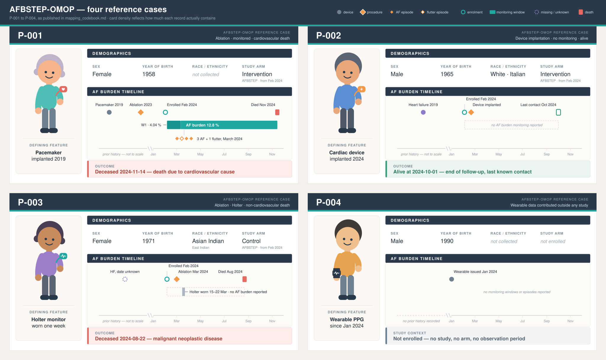

# How to map typical source data into AFBSTEP-OMOP conform data sets

Clinical studies think in visits: baseline, month 3, month 12,
unscheduled. OMOP has no visit schedule. Every fact carries the
calendar date on which it holds, and "baseline" versus "follow-up" is
not a flag or a separate table. It is the position of that date
relative to the person's enrolment date.

With that principle in place, the following sections walk through the 
actual mapping process, covering Standard OMOP mapping (the core tables, 
including how the original source code is preserved alongside a mapped 
concept) as well as special procedures for mapping:

- study information
- comorbidities / historical diagnoses
- cardiac monitoring (AF burden data)
- device information
- external source file references 
- missingness

each with an example drawn from the same four reference persons displayed below.

**Note.** For information about the AFBSTEP-OMOP-CDM structure read `afbstepomop_schema_description.md`. 
The following scenarios cover only the actual mapping. 

## Typical structure of source datasets

A simple baseline dataset and a follow-up dataset are provided here, which may be available in this form or a similar one in their original format. The following sections describe, in schematic terms, how this data can be mapped to the standard OMOP and custom AFBSTEP tables, and how specific mapping situations, such as missing values, should be handled.

These four tables collect every variable used across this guideline's
examples, for the four reference persons (P-001–P-004), so
every section's example can be checked against the same underlying
data.

Four patients, spanning plausible variation across every table in
this section:
- P-001 — an ablation with drug therapy, a measurement, cardiac monitoring, and cardiovascular death
- P-002 — a device implantation with an observation, no drug exposure, and no death
- P-003 — an ablation with a different energy-source, a measurement and observation, and a non-cardiovascular death
- P-004 — a wearable user contributed outside any study, so no `study` or `person_study` row

### Baseline table

| person_id | gender | year_of_birth | race | ethnicity | study_id | study_arm | enrollment_date | visit_type | observation_period_end | procedure | device | device_start | device_end | device_algorithm | device_serial_number | drug | drug_start | drug_end | creatinine | haemoglobin | lvef_percent | condition | condition_case_type | diabetes | linked_file_type |
|---|---|---|---|---|---|---|---|---|---|---|---|---|---|---|---|---|---|---|---|---|---|---|---|---|---|
| P-001 | FEMALE | 1958 | not collected | not collected | 1 | Intervention | 2024-02-01 | Outpatient | 2024-11-14 | — | Cardiac pacemaker | 2019-06-02 | *(empty)* | AF-Detect-Pro | SN-481920 | Vitamin K antagonist | 2024-01-10 | *(ongoing)* | 1.1 mg/dL | — | *(never assessed)* | Heart failure, newly confirmed at baseline (2024-02-01) | Case 1 | positive | Prescription document |
| P-002 | MALE | 1965 | White | Italian | 1 | Intervention | 2024-02-03 | Inpatient | 2024-10-01 | Cardiac device implantation | CIED present | 2024-02-20 | *(empty)* | — | — | — | — | — | — | — | Heart failure, confirmed historical (2019-11-03) | Case 2 | negative | — |
| P-003 | FEMALE | 1971 | Asian Indian | East Indian | 1 | Control | 2024-02-05 | Inpatient | 2024-08-22 | AF ablation | Radiofrequency energy source | 2024-03-01 | *(empty)* | — | — | — | — | — | 38 % | Heart failure, history of, ascertained 2024-02-05 | Case 3 | *(never assessed)* | — |
| P-004 | MALE | 1990 | not collected | not collected | — | — | — | — | — | — | Wearable PPG device | 2024-01-01 | *(empty)* | — | — | — | — | — | — | — | — | — | — | — |

### Follow-up table

| person_id | timepoint | procedure | device | condition | af_window_type | af_burden_percent | rhythm_type | max_heart_rate | mehra_class | death_date | death_cause | linked_file_type |
|---|---|---|---|---|---|---|---|---|---|---|---|---|
| P-001 | Prior history | AF ablation | Pulsed-field energy source | — | — | — | — | — | — | — | — | — |
| P-001 | Prior history (complication) | — | — | Peri-procedural complication, unspecified | — | — | — | — | — | — | — | — |
| P-001 | Window 1 | — | — | — | Aggregated | 4.04 | — | — | — | — | — | CIED remote monitoring report file, CIED remote-monitoring data |
| P-001 | Window 2 | — | — | — | Aggregated | 12.8 | — | — | — | — | — | — |
| P-001 | Episode 1 (in window 2) | — | Wearable PPG | — | Disaggregated | — | Atrial fibrillation | 188 | — | — | — | — |
| P-001 | Episode 2 (in window 2) | — | Wearable PPG | — | Disaggregated | — | Atrial flutter | 165 | — | — | — | — |
| P-001 | Episode 3 (in window 2) | — | Wearable PPG | — | Disaggregated | — | Atrial fibrillation | 201 | — | — | — | — |
| P-001 | Episode 4 (in window 2) | — | Wearable PPG | — | Disaggregated | — | Atrial fibrillation | 176 | — | — | — | — |
| P-001 | mEHRA assessment | — | — | — | — | — | — | — | Unable to determine (Case 4) | — | — | — |
| P-001 | End of follow-up | — | — | — | — | — | — | — | — | 2024-11-14 | Death due to cardiovascular cause, unspecified | — |
| P-002 | Follow-up lab | — | — | — | — | — | — | — | — | — | — | PDF or scanned document reference |
| P-002 | mEHRA assessment | — | — | — | — | — | — | — | Missing, cause unknown (Case 5) | — | — | — |
| P-003 | Follow-up device | — | Holter monitor | — | — | — | — | — | — | — | — | — |
| P-003 | mEHRA assessment | — | — | — | — | — | — | — | Class IIb | — | — | PDF or scanned document reference |
| P-003 | End of follow-up | — | — | — | — | — | — | — | — | 2024-08-22 | Malignant neoplastic disease | — |

### Device registry table

| person_id | device_id | device_kind | manufacturer | model | serial_number | hw_version | device_algorithm | algorithm_version | in_use_from | in_use_to | linked_case |
|---|---|---|---|---|---|---|---|---|---|---|---|
| P-001 | D-0001 | Cardiac pacemaker | Biotronik | Edora 8 DR-T | SN-773011 | 1.2 | — | — | 2019-06-02 | *(empty)* | — |
| P-001 | D-0002 | Wearable PPG device | Withings | ScanWatch 2 | SN-481920 | 1.0 | AF-Detect-Pro | 2.3 | 2024-01-15 | *(empty)* | — |
| P-001 | D-0003 | Ablation generator | Farapulse | FARAPULSE FARAWAVE | *(empty)* | *(empty)* | — | — | 2023-11-02 | *(empty)* | F-0002 |
| P-002 | D-0004 | CIED, unspecified type | Medtronic | *(not stated)* | *(empty)* | *(empty)* | — | — | 2024-02-20 | *(empty)* | F-0003 |
| P-003 | D-0005 | Ablation generator | Biosense Webster | SMARTTOUCH SF | *(empty)* | *(empty)* | — | — | 2024-03-01 | *(empty)* | F-0004 |
| P-003 | D-0006 | Holter monitor | GE | SEER 1000 | SN-220145 | 3.1 | — | — | 2024-03-15 | 2024-03-22 | — |
| P-004 | D-0007 | Wearable PPG device | Apple | Watch Series 9 | SN-903771 | 9.0 | AFib-History | 1.4 | 2024-01-01 | *(empty)* | — |

### Study information table

| study_id | entry_kind | person_id | key | value | note |
|---|---|---|---|---|---|
| S1 | meta | — | study_name | AFBSTEP | — |
| S1 | meta | — | nct | NCT01234567 | — |
| S1 | meta | — | contributor | UKE | — |
| S1 | meta | — | ext_affiliate | 0 | — |
| S1 | meta | — | ext_affiliate_name | *(empty)* | — |
| S1 | meta | — | study_kind | OBS-COHORT | — |
| S1 | meta | — | n_subjects | 5000 | — |
| S1 | meta | — | data_from | 2024-01-01 | — |
| S1 | meta | — | data_to | *(empty)* | — |
| S1 | meta | — | median_fu_months | 18 | — |
| S1 | meta | — | ds_status | rolling | — |
| S1 | meta | — | transfer_mode | periodic | — |
| S1 | country | — | — | IT | — |
| S1 | country | — | — | IN | — |
| S1 | provision | — | — | TAB | — |
| S1 | provision | — | — | TAB+SIG | — |
| S1 | arm | — | — | Physical Intervention | treatment |
| S1 | arm | — | — | Clinical Intervention | treatment |
| S1 | arm | — | — | Control | control |
| S1 | enrollment | P-001 | — | Physical Intervention | 2024-02-01 |
| S1 | enrollment | P-002 | — | Clinical Intervention | 2024-02-03 |
| S1 | enrollment | P-003 | — | Control | 2024-02-05 |

### Fact sheets for P-001 to P-004

**The following four profiles illustrate these individuals we will use to explain the various mapping procedures described below.**

 


# Basic mapping process

This section shows the final mapped tables from the example source data sets for "straightforward" cases.  
**General rule:** The `unit_concept_id` is required wherever `value_as_number` is populated.

### Mapped `person` table

| person_id | gender_concept_id | year_of_birth | race_concept_id | ethnicity_concept_id | person_source_value |
|---|---|---|---|---|---|
| P-001 | `8532` (FEMALE) | 1958 | `0` (not collected) | `0` (not collected) | P-001 |
| P-002 | `8507` (MALE) | 1965 | `8527` (White) | `1546579` (Italian) | P-002 |
| P-003 | `8532` (FEMALE) | 1971 | `38003574` (Asian Indian) | `1546388` (East Indian) | P-003 |
| P-004 | `8507` (MALE) | 1990 | `0` (not collected) | `0` (not collected) | P-004 |


P-001 reflects the common case for AFBSTEP's European sites, where
race and ethnicity are typically not collected. P-002 shows the broad 
"White" category. P-003 shows a provider whose source data was specific 
enough to use the finer-grained `38003574` ("Asian Indian") rather 
than defaulting to the broad "Asian" concept.

### Mapped `visit_occurrence` table

| visit_occurrence_id | person_id | visit_concept_id | visit_start_date | visit_end_date | visit_type_concept_id |
|---|---|---|---|---|---|
| 1 | P-001 | `9201` (Inpatient) | 2023-11-02 | 2023-11-03 | `32827` |
| 2 | P-001 | `9202` (Outpatient) | 2024-02-01 | 2024-02-01 | `32827` |
| 3 | P-002 | `9201` (Inpatient) | 2024-02-20 | 2024-02-21 | `32827` |
| 4 | P-003 | `9201` (Inpatient) | 2024-03-01 | 2024-03-02 | `32827` |
| 5 | P-003 | `9202` (Outpatient) | 2024-03-15 | 2024-03-15 | `32827` |

### Mapped `observation_period` table

| observation_period_id | person_id | observation_period_start_date | observation_period_end_date | period_type_concept_id |
|---|---|---|---|---|
| 1 | P-001 | 2024-02-01 | 2024-11-14 | `44814723` |
| 2 | P-002 | 2024-02-03 | 2024-10-01 | `44814723` |
| 3 | P-003 | 2024-02-05 | 2024-08-22 | `44814723` |

P-002's end date is the date of last known contact (P-002 is still
alive). P-001 and P-003 end at their date of death.

### Mapped `procedure_occurrence` table

| procedure_occurrence_id | person_id | procedure_concept_id | procedure_date | procedure_type_concept_id | visit_occurrence_id |
|---|---|---|---|---|---|
| 1 | P-001 | `2000003000` (AF ablation, other/unspecified) | 2023-11-02 | `32827` | 1 |
| 2 | P-002 | `2000003006` (Cardiac device implantation or revision) | 2024-02-20 | `32827` | 3 |
| 3 | P-003 | `2000003000` (AF ablation, other/unspecified) | 2024-03-01 | `32827` | 4 |

### Mapped `device_exposure` table

| device_exposure_id | person_id | device_concept_id | device_exposure_start_date | device_exposure_end_date | device_type_concept_id |
|---|---|---|---|---|---|
| 1 | P-001 | `4030875` (Cardiac pacemaker) | 2019-06-02 | *(empty)* | `32817` |
| 2 | P-001 | `2000004006` (Wearable PPG device) | 2024-01-15 | *(empty)* | `705183` |
| 3 | P-001 | `2000004007` (Pulsed-field energy source) | 2023-11-02 | *(empty)* | `32817` |
| 4 | P-002 | `2000004000` (CIED present, any type) | 2024-02-20 | *(empty)* | `32817` |
| 5 | P-003 | `2000004001` (Radiofrequency energy source) | 2024-03-01 | *(empty)* | `32817` |
| 6 | P-003 | `45762052` (Electrocardiographic long-term ambulatory recorder) | 2024-03-15 | 2024-03-22 | `32817` |
| 7 | P-004 | `2000004006` (Wearable PPG device) | 2024-01-01 | *(empty)* | `705183` |

P-001 has a cardiac pacemaker that was implanted years before enrolment in the study and is still in use (a permanent device with no expiry date). The entry for the pulse field energy source for P-001, on the other hand, describes a one-off entry relating to the ablation procedure. P-003 has an ablation energy source without an accompanying implanted device and has a Holter monitor which was worn for one week during follow-up (a temporary, dated device with an actual expiry date).

### Mapped `drug_exposure` table

| drug_exposure_id | person_id | drug_concept_id | drug_exposure_start_date | drug_exposure_end_date | drug_type_concept_id |
|---|---|---|---|---|---|
| 1 | P-001 | `2000012000` (Vitamin K antagonist) | 2024-01-10 | 2099-12-31 *(ongoing)* | `32809` |

Only P-001 has a `drug_exposure` row.

### Mapped `measurement` table

| measurement_id | person_id | measurement_concept_id | value_as_number | unit_concept_id | measurement_date | measurement_type_concept_id |
|---|---|---|---|---|---|---|
| 1 | P-001 | `3016723` (Serum creatinine) | 1.1 | `8840` (mg/dL) | 2024-02-01 | `32809` |
| 8 | P-002 | `3000963` (Haemoglobin) | 142 | `8636` (g/L) | 2024-02-20 | `32809` |
| 16 | P-003 | `3027172` (LVEF) | 38 | `8554` (percent) | 2024-03-01 | `32809` |

### Mapped `observation` table

| observation_id | person_id | observation_concept_id | value_as_concept_id | observation_date | observation_type_concept_id |
|---|---|---|---|---|---|
| 70 | P-003 | `2000009007` (mEHRA symptom class) | `2000009010` (Class IIb) | 2024-03-01 | `32809` |


### Mapped `death` table

| person_id | death_date | death_type_concept_id | cause_concept_id |
|---|---|---|---|
| P-001 | 2024-11-14 | `44803317` | `2000006001` (Death due to cardiovascular cause, unspecified) |
| P-003 | 2024-08-22 | `44803317` | `443392` (Malignant neoplastic disease) |

P-002 has no `death` row since he is still alive at the end of the observation
period.

## Mapping study information

`study` describes a source study contributing data, present only when
a partner submits data in a study context, not for standalone
submissions (e.g. a wearable data feed with no associated trial).
`person_study` links a person to the study they were enrolled in,
including which arm they were assigned to.

One study, three enrolled persons across two arms, two countries, two
provision levels.

### Mapped `study` table

| study_id | study_name | nct_number | contributor | study_type_concept_id | n_data_subjects | study_start_date | study_end_date | median_follow_up_months | dataset_status_concept_id | transfer_frequency_concept_id |
|---|---|---|---|---|---|---|---|---|---|---|
| 1 | AFBSTEP | NCT01234567 | UKE | `2000013003` (Observational cohort) | 5000 | 2024-01-01 | *(empty — ongoing)* | 18 | `2000013008` (Rolling) | `2000013010` (Periodic) |

### Mapped `study_attribute` table

| study_id | attribute_type_concept_id | value_concept_id |
|---|---|---|
| 1 | `2000013015` (Data provision level) | `2000013012` (Tabular analysis data) |
| 1 | `2000013015` (Data provision level) | `2000013013` (Tabular analysis data incl. raw signals) |
| 1 | `2000013016` (Country of data collection) | `41987173` (Italy) |
| 1 | `2000013016` (Country of data collection) | `4320154` (India) |

In general, the information for the `study` and `study_attribute` table 
should already be included in your entries on the metadata portal, so 
that entering the this information should not be necessary.

### Mapped `person_study` table

| person_id | study_id | observation_period_id | enrollment_date | arm_source_value | arm_type_concept_id |
|---|---|---|---|---|---|
| P-001 | 1 | 1 | 2024-02-01 | Physical Intervention | `37529738` (Intervention arm) |
| P-002 | 1 | 2 | 2024-02-03 | Clinical Intervention | `37529738` (Intervention arm) |
| P-003 | 1 | 3 | 2024-02-05 | Control | `37542561` (Control arm) |

P-001 and P-002 took part in different intervention groups (`arm_source_value`). 
Nevertheless, both are grouped under the same `arm_type_concept_id`. 

P-004 has no entry in the `person_study` table, as the person only 
provides data from a wearable device and is not enrolled as a participant
 or patient in a study. In accordance with the OMOP convention, the absence 
of a row here indicates that a piece of information does not apply to 
a particular table or field.

# Special mapping process

This section goes through "difficult" cases, *i.e.* mapping 

## Mapping comorbidities and historical diagnoses

A baseline comorbidity can reach the source system in three different
ways: established at the point of enrolment, known from history with a
real date, or known from history with no date available. Each maps
differently. 

### The three cases

#### Case 1 — Established at the baseline visit

The diagnosis is made, or confirmed, as part of the baseline
assessment itself.

The baseline visit is the `visit_occurrence` row marked by an
`observation` row carrying concept `2000013017` ("Baseline visit"; see
"Marking the baseline visit" below)

**Pattern:** one `condition_occurrence` row.

```
condition_concept_id        = <the diagnosis>
condition_start_date        = <the date of the visit marked 2000013017, or the enrolment date if none>
condition_type_concept_id   = <provenance, constant per data provider>
visit_occurrence_id         = <the visit marked 2000013017, else empty>
```

#### Case 2 — Historical, true date known

The diagnosis was made in the past, at a real, known date, e.g. a prior
hospital record, a discharge letter, a patient-reported year that the
source system stores precisely.

**Pattern:** one `condition_occurrence` row, dated at the true event,
not at the baseline visit.
```
condition_concept_id          = <the diagnosis>
condition_start_date          = <the actual historical diagnosis date>
condition_type_concept_id     = <provenance, constant per data provider>
visit_occurrence_id           = NULL
```

`condition_status_concept_id` is left empty here: the `Condition
Status` domain only contains concepts describing a diagnosis's role
within a hospital encounter (admitting, discharge, primary,
secondary...).

#### Case 3 — Historical, true date unknown

The diagnosis is known to exist, but the source has no reliable date
for it; only the date at which it was asked about or discovered.

**Pattern:** one `condition_occurrence` row, using the fixed sentinel
date `1900-01-01` in place of the unknown true diagnosis date.
```
condition_concept_id            = <the diagnosis>
condition_start_date            = 1900-01-01
condition_type_concept_id       = <provenance, constant per data provider>
visit_occurrence_id             = NULL
```

**This is the project's deliberate** 
`1900-01-01` is the *only* indicater that distinguishes Case 2 from Case 3: 
both have `condition_status_concept_id = NULL`. If selections are subsequently 
made for analyses based on the `condition_start_date`, all entries with 
`1900-01-01` must be removed or handled specially beforehand.

### Possible `condition_type_concept_ids` to use

| concept_id | concept_name | Typical use |
|---|---|---|
| `32809` | Case Report Form | Diagnosis captured on a structured study form (e.g. a baseline CRF field) |
| `32865` | Patient self-report | Diagnosis obtained by directly asking the patient |
| `32879` | Registry | Diagnosis sourced from an existing registry or database, not an active data collection |
| `32827` | EHR encounter record | Diagnosis sourced from an electronic health record |

Providers should choose the concept that best matches how the source
actually captured the diagnosis, and hold it constant for a given data
source. If none of the concepts are suitable, a search for more
appropriate concepts can be carried out at athena.ohdsi.org. It is
important to ensure that these are `type_concept_ids`. Assigning your
own concept codes is prohibited.

### Marking the baseline visit

Some protocols distinguish a baseline visit — the visit at which
enrolment assessments (comorbidities, vitals, labs) are performed —
from all later visits. OMOP's `visit_occurrence` table has no field for
this role; AFBSTEP marks it explicitly with a custom concept so that
downstream analysis can identify the baseline visit without guessing
from dates.

**Pattern:** one `observation` row per person, at most.

```
observation_concept_id      = 2000013017 ("Baseline visit")
observation_date            = <the visit's start date>
observation_type_concept_id = <provenance, constant per data provider>
observation_event_id        = <the baseline visit_occurrence_id>
obs_event_field_concept_id  = 1147869 ("visit_occurrence.visit_occurrence_id")
```

**When to use it.** Where the source protocol has a distinct baseline
visit, mark that one `visit_occurrence` row this way. This is independent 
of whether the visit date coincides with `person_study.enrollment_date` /
`observation_period_start_date`.

**When to omit it.** A partner whose protocol has no distinct baseline
visit, enrolment happens without a dedicated visit, or the source data
does not distinguish between baseline and enrolment date, omits this entry.
**Comorbidity Case 1** then falls back to the enrolment date.

**Constraints.** If a person has more than one candidate visit, 
the data provider decides which one is the baseline visit. 

### Example

**Source information**

Three patients, one comorbidity (heart failure, `316139`), one
instance of each case.

| person_id | source information | Case |
|---|---|---|
| P-001 | Heart failure newly confirmed at the baseline visit (2024-02-01) | 1 |
| P-002 | Heart failure since a documented hospitalisation on 2019-11-03 | 2 |
| P-003 | Heart failure noted in the patient's history at enrolment (2024-02-05); no date of onset available | 3 |

#### Mapped `condition_occurrence` table

| condition_occurrence_id | person_id | condition_concept_id | condition_start_date | condition_status_concept_id | visit_occurrence_id |
|---|---|---|---|---|---|
| 2 | P-001 | `316139` (Heart failure) | 2024-02-01 | *(empty)* | 2 |
| 3 | P-002 | `316139` (Heart failure) | 2019-11-03 | *(empty)* | *(empty)* |
| 4 | P-003 | `316139` (Heart failure) | 1900-01-01 | *(empty)* | *(empty)* |
| 72 | P-001 | `2000005000` (Peri-procedural complication, unspecified) | 2023-11-02 | *(empty)* | 1 |

## Mapping cardiac monitoring (AF burden data): Aggregated vs. Disaggregated

Rhythm monitoring sources are heterogeneous: implantable loop recorders, pacemakers and ICDs, Holter ECGs, patches, wearables, intermittent spot recordings. 

Some report every detected rhythm episode; others report only summary statistics over a period of time; some report both. AFBSTEP-OMOP holds both without forcing either, using the standard OMOP `episodes` table as the anchor.

AFBSTEP records atrial fibrillation (burden) in two structurally different
ways, distinguished by `episode.episode_concept_id`. The specific concepts that can be assigned to the two scenarios differ. This section explains the individual concepts and their assignment within the CDM for each case and illustrates them with an example.

#### The two cases

| | Case A — Aggregated window | Case B — Disaggregated episode |
|---|---|---|
| `episode_concept_id` | `2000011002` | `2000011003` |
| Represents | A continuous monitoring window (e.g. 3 months), summarised into burden statistics | A single, discrete arrhythmia episode |
| Typical source | CIED remote monitoring, continuous | Holter, event recorder, single-episode detection |
| `episode.episode_type_concept_id` | `32828` ("EHR episode record") for both cases. This field records provenance, not the case, and is constant across all episode rows |

#### Linking Case A and Case B rows to measurements and observations

For linking measurement/observation rows to their episode use the direct event
columns in the measurement/observation table:

```
measurement.measurement_event_id        = <the episode_id>
measurement.meas_event_field_concept_id = 798885 ("episode.episode_id")

observation.observation_event_id        = <the episode_id>
observation.obs_event_field_concept_id  = 798885 ("episode.episode_id")
```

#### Linking a Case B episode to its parent Case A window

A device may report both simultaneously, an aggregated window plus
individual episodes that occurred within it. When it does, use
`episode_event` to link them. Case B is thus interpreted as a single event within Episode Case A:

```
episode_event.episode_id = <the Case A window's episode_id>
episode_event.event_id = <the Case B episode's episode_id>
episode_event.episode_event_field_concept_id = 798885 ("episode.episode_id")
```

This relationship is optional. A device that reports only one of the
two case types has no linking row.

#### Assessment modality (device, shared by both cases)

The source codebook records the assessing device/technique twice,
once for windows and once for individual episodes, but both route to
`device_exposure.device_concept_id` and both use the same concepts.
There is no separate concept set for episode-level vs. window-level
modality. See possible device type `device_concept_id` values in
the device mapping document for the full list.

### Concepts scoped to Case A (`valid_for_episode_type = 2000011002`)

#### AF burden measures

| concept_id | concept_name | CDM_table.field | unit | range | notes |
|---|---|---|---|---|---|
| `2000008002` | AF burden, percent time in AF | measurement.measurement_concept_id | `8554` (percent) | 0–100 | The primary window-level quantity |
| `2000008007` | Fraction of days in sinus rhythm | observation.observation_concept_id | `8554` (percent) | 0–100 | EAST-AFNET 4 sensitivity definition |
| `2000008008` | Number of analysable ECGs in monitoring period | observation.observation_concept_id | unitless | 0–no upper bound | Denominator for intermittent AF burden estimation |
| `2000008009` | Number of ECGs classified as AF | observation.observation_concept_id | unitless | 0–no upper bound | Numerator; must not exceed `2000008008` |
| `2000007003` | Monitoring adherence (weeks with transmission) | observation.observation_concept_id | `8554` (percent) | 0–100 | Zeemering definition (EAST-AFNET 4) |

#### AF burden estimation method

| concept_id | concept_name |
|---|---|---|
| `2000008004` | percent time, continuous CIED monitoring |
| `2000008005` | percent ECGs, intermittent monitoring |
| `2000008006` | derived from days in sinus rhythm |

#### Mode of assessment

| concept_id | concept_name |
|---|---|---|
| `2000009034` | Continuous monitoring mode |
| `2000009001` | Intermittent monitoring mode |
| `2000009002` | Single assessment mode |

#### Window-level episode statistics (derived from the episodes within the window)

| concept_id | concept_name | CDM_table.field | unit | range | notes |
|---|---|---|---|---|---|
| `2000009013` | Longest AF episode duration during window | measurement | `8555` (second) |0–no upper bound||
| `2000009014` | Shortest AF episode duration during window | measurement | `8555` (second) |0–no upper bound||
| `2000009015` | Average AF episode duration during window | measurement | `8555` (second) |0–no upper bound||
| `2000009016` | SD of AF episode duration during window | measurement | `8555` (second) |0–no upper bound||
| `2000009017` | Average heart rate during AF | measurement | `8483` (counts/min) | 20–300 ||
| `2000009018` | SD of average heart rate during AF | measurement | `8483` (counts/min) |0–no upper bound||
| `2000009020` | Number of AF episodes during window | measurement | unitless |0–no upper bound|
| `2000009021` | Absolute time in AF during window | measurement | `8555` (second) |0–no upper bound| Complements the percent-based `2000008002` |
| `2000009022` | Date of first AF detection within window | observation | — | Date field, not a value field |

#### Device diagnostics (device-reported, window-level)

| concept_id | concept_name | CDM_table.field | unit | range |
|---|---|---|---|---|
| `2000009023` | Percent atrial paced | measurement | `8554` (percent) | 0–100 |
| `2000009024` | Percent ventricular paced | measurement | `8554` (percent) | 0–100 |
| `2000009025` | Number of AT/AF shocks delivered | measurement | unitless | 0–no upper bound|
| `2000009026` | Number of VT/VF shocks delivered | measurement | unitless |0–no upper bound |
| `2000009027` | Device-measured patient activity duration | measurement | `8555` (second) | 0–no upper bound|
| `2000009028` | Fluid status threshold crossing count | measurement | unitless |0–no upper bound |
| `2000009029` | Spontaneous NST episode count per day | measurement | unitless |0–no upper bound |
| `2000009030` | PVC burden, percent of beats | measurement | `8554` (percent) | 0–100 |
| `2000009031` | Daily thoracic impedance | measurement | `9618` (ohm) |0–no upper bound |
| `2000009032` | Accumulated thoracic impedance deviation | measurement | `9618` (ohm) |0–no upper bound |
| `2000009033` | Reference thoracic impedance baseline | measurement | `9618` (ohm) | 0–no upper bound|
| `21491502` | Heart rate variability (SD of R-R interval) | measurement | `9593` (millisecond) | 0–no upper bound|
| `3006307` | R-R interval (Mean value during study) | measurement | `9593` (millisecond) |0–no upper bound |
| `46235177` | R-R interval (Maximum value during study) | measurement | `9593` (millisecond) |0–no upper bound |
| `46235178` | R-R interval (Minimum value during study) | measurement | `9593` (millisecond) |0–no upper bound |
| `2000009035` | Daytime resting heart rate | measurement | `8483` (counts/min) | 20–300 |
| `2000009036` | Nighttime resting heart rate | measurement | `8483` (counts/min) | 20–300 |
| `2000009037` | Maximum heart rate during AF within window | measurement | `8483` (counts/min) | 20–300 |


### Concepts scoped to Case B (`valid_for_episode_type = 2000011003`)

| concept_id | concept_name | CDM_table.field | unit | range | notes |
|---|---|---|---|---|---|
| `2000009003` (numeric variant) | AF/atrial arrhythmia episode duration | observation.value_as_number | `8555` (second) | 0–no upper bound | AF episodes can last days; only the lower bound is fixed |
| `2000009003` (categorical variant) | AF/atrial arrhythmia episode duration | observation.value_as_concept_id | — | — | Same concept_id, second row for the rhythm-type answer; see answers below |
| `2000009004` | Maximum atrial/ventricular rate during arrhythmia episode | measurement | `8483` (counts/min) | 20–300 | |
| `2000009005` | Symptomatic status during arrhythmia episode | observation | — | — | Answers: `4142947` ("Symptomatic"), `4284245` ("Asymptomatic") |
| `2000009019` | Number of beats per AF episode | observation | unitless | 0–no upper bound | |

#### Rhythm type

| concept_id | concept_name | Origin |
|---|---|---|
| `4154290` | Paroxysmal atrial fibrillation | Standard |
| `4232697` | Persistent atrial fibrillation | Standard |
| `45768480` | Longstanding persistent atrial fibrillation | Standard |
| `4232691` | Permanent atrial fibrillation | Standard |
| `314665` | Atrial flutter | Standard |
| `4171269` | Atrial tachycardia | Standard |


#### Concepts related to AF, but not scoped to either case

Some AF-relevant concepts describe the patient's overall status rather
than a specific window or episode, and carry no `valid_for_episode_type`
value.

| concept_id | concept_name | notes |
|---|---|---|
| `4154290` | Paroxysmal | — |
| `4232697` | Persistent | — |
|`45768480` | Longstanding persistent | — |
| `4232691` | Permanent  | — |
| `2000000000` | Non-paroxysmal atrial fibrillation (unspecified) | 
| `2000009006` | AFEQT Score | — | Unitless, 0–100. Patient-reported |
| `2000009008`–`2000009012` | mEHRA class I – IV | — |

### Example

#### Mapped `episode` table

| episode_id | person_id | episode_concept_id | episode_start_datetime | episode_end_datetime | episode_type_concept_id |
|---|---|---|---|---|---|
| 1 | P-001 | `2000011002` (Window) | 2024-02-05 14:31 | 2024-02-12 12:06 | `32828` |
| 2 | P-001 | `2000011002` (Window) | 2024-02-12 12:06 | 2024-11-14 14:12 | `32828` |
| 3 | P-001 | `2000011003` (Episode) | 2024-03-19 08:14 | 2024-03-19 08:19 | `32828` |
| 4 | P-001 | `2000011003` (Episode) | 2024-03-20 14:02 | 2024-03-20 14:07 | `32828` |
| 5 | P-001 | `2000011003` (Episode) | 2024-03-21 03:45 | 2024-03-21 03:48 | `32828` |
| 6 | P-001 | `2000011003` (Episode) | 2024-03-22 19:30 | 2024-03-22 19:33 | `32828` |

#### Mapped `measurement` table

| measurement_id | measurement_concept_id | value_as_number | unit_concept_id | measurement_event_id | meas_event_field_concept_id |
|---|---|---|---|---|---|
| 277 | `2000008002` (AF burden) | 4.04 | `8554` (percent) | 1 | `798885` |
| 278 | `2000008002` (AF burden) | 12.8 | `8554` (percent) | 2 | `798885` |
| 299 | `2000009004` (max rate) | 188 | `8483` (counts/min) | 3 | `798885` |
| 300 | `2000009004` (max rate) | 165 | `8483` (counts/min) | 4 | `798885` |
| 301 | `2000009004` (max rate) | 201 | `8483` (counts/min) | 5 | `798885` |
| 302 | `2000009004` (max rate) | 176 | `8483` (counts/min) | 6 | `798885` |

#### Mapped `observation` table

| observation_id | observation_concept_id | value_as_concept_id | observation_event_id | obs_event_field_concept_id |
|---|---|---|---|---|
| 125 | `2000009003` | `313217` (Atrial fibrillation) | 3 | `798885` |
| 126 | `2000009003` | `314665` (Atrial flutter) | 4 | `798885` |
| 127 | `2000009003` | `313217` (Atrial fibrillation) | 5 | `798885` |
| 128 | `2000009003` | `313217` (Atrial fibrillation) | 6 | `798885` |

No `episode_event` rows exist in this example. The CIED windows and
the wearable episodes come from different devices, so there is nothing
to link.
 
## Mapping device information

Device information is split across two tables. `device_exposure` is
the official OMOP table and holds device identity; which device, and
when it was put into use. `device_specs` is an AFBSTEP extension and
holds per-episode device attributes that the official CDM has no
field for, including the detection algorithm, its version, 
and the device's serial number and hardware version.

#### Possible device type `device_concept_id` values

| concept_id | concept_name | Origin | Typical use |
|---|---|---|---|
| `2000004000` | CIED present (any type) | Custom | —|
| `45762052` | Electrocardiographic long-term ambulatory recorder | Standard | Holter ECG |
| `45768113` | Electrocardiograph | Standard | Resting ECG |
| `45762462` | Electrocardiography telemetric monitoring system | Standard | Tele-ECG |
| `2000004006` | Wearable photoplethysmography device (smartwatch/smart ring) | Custom | PPG wearable |
| `1448963` | Implantable electrocardiographic monitor and loop recorder | Standard | Implantable loop recorder |
| `45877787` | Continuous Cardiac Monitoring | Standard | — |
| `37164898` | Subcutaneous implantable cardioverter defibrillator | Standard | S-ICD |
| `4030875` | Cardiac pacemaker | Standard | — |
| `45767328` | Cardiac resynchronization therapy implantable defibrillator | Standard | CRT-D |
| `45767329` | Cardiac resynchronization therapy implantable pacemaker | Standard | CRT-P |

#### Ablation energy source devices

These `device_concept_id` values identify the energy modality used
during an ablation procedure, rather than a monitoring device. They
apply to `device_exposure` rows linked to a `procedure_occurrence` (the
ablation itself), not to episode-linked monitoring rows — do not use
them in the `device_specs` context described above. For these,
**set only `device_exposure_start_date`; leave
`device_exposure_end_date` empty.** Recording an identical start and
end date would be redundant, since the application has no duration
beyond that single date to distinguish.

| concept_id | concept_name | notes |
|---|---|---|
| `2000004001` | Radiofrequency energy source | |
| `2000004002` | Cryoballoon energy source | |
| `2000004007` | Pulsed-field energy source | Custom — no matching abstract energy-source concept exists in SNOMED for this modality; available concepts describe a physical catheter/system instead |
| `2000004003` | Laser energy source | |
| `2000004004` | Other/unspecified ablation energy source | Catch-all when the specific modality is not reported |
| `2000004005` | Other/unspecified ablation energy source for pulmonary vein to left atrium conduction system | More specific variant of `2000004004`, scoped to PVI |

#### Linking device_specs to device_exposure

`device_specs.device_exposure_id` must always be set. 
Since `device_concept_id` is stored in `device_exposure` `device_specs` 
has no identifier to which device its algorithm and serial-number fields 
should be linked. Every `device_specs` row therefore requires a corresponding 
device_exposure row to link to.

#### Difference between `device_exposure_start_date` and `episode_start_datetime`

`device_exposure` describes when a device was first put into use; for an implanted device the date of implantation; for a wearable the date on which the study participant began using it. 

`episode_start_datetime`, on the other hand, describes the start of a specific recording window or a single episode. These two dates almost never coincide for a continuous-use device. They will only be identical for a device applied exclusively for a single, brief measurement (e.g. ECG) or if the recording begins immediately upon commissioning. `device_exposure_end_date` remains empty as long as the device remains implanted or in use. A missing value here does not mean ‘unknown’, but rather ‘still ongoing’. If a device is replaced during the study, the first device is assigned an entry in `device_exposure_end_date` and the new one an entry in `device_exposure_start_date`.

### Example

The wearable from the AF burden worked example (issued 2024-01-15,
`device_exposure_id = 2`) detects four episodes. Its detection
algorithm is updated between the second and third episode. The same
person also has a prior pulmonary vein isolation procedure, performed
using pulsed-field ablation.

#### `device_exposure`

| device_exposure_id | person_id | device_concept_id | device_exposure_start_date | device_exposure_end_date | device_type_concept_id |
|---|---|---|---|---|---|
| 1 | P-001 | `4030875` (Cardiac pacemaker) | 2019-06-02 | *(empty)* | `32817` |
| 2 | P-001 | `2000004006` (Wearable PPG device) | 2024-01-15 | *(empty)* | `705183` |
| 3 | P-001 | `2000004007` (Pulsed-field energy source) | 2023-11-02 | *(empty)* | `32817` |

Both windows (episodes 1 and 2) share the same CIED `device_exposure`
row, dated to implantation rather than to either recording window. The
same applies to the wearable and all four of its episodes. 

`device_exposure_id = 2` is the monitoring device the rest of this
example builds on, a continuously worn device with no end date, since
it remains in use. `device_exposure_id = 3` is the single-application
case: the ablation energy source used on one date, with no end date
per the convention above. No `device_specs` row links to it, since
algorithm/serial-number detail applies to monitoring devices, not to a
procedural energy modality.

#### `device_specs`

| episode_id | person_id | device_exposure_id | device_algorithm | device_algorithm_v | device_sn | device_v |
|---|---|---|---|---|---|---|
| 3 | P-001 | 2 | AF-Detect-Pro | 2.3 | SN-481920 | 1.0 |
| 4 | P-001 | 2 | AF-Detect-Pro | 2.3 | SN-481920 | 1.0 |
| 5 | P-001 | 2 | AF-Detect-Pro | 2.4 | SN-481920 | 1.0 |
| 6 | P-001 | 2 | AF-Detect-Pro | 2.4 | SN-481920 | 1.0 |

`device_sn` and `device_v` are identical across all four rows. The
same physical device produced all four episodes. `device_algorithm_v`
changes from 2.3 to 2.4 partway through, reflecting a firmware update
that a device-level-only record could not have captured.
`device_exposure_id = 3` (the ablation energy source) has no
corresponding `device_specs` rows at all.

## Mapping external source file references

Some source data does not fit into a CDM value field, a scanned
PDF report, a raw waveform recording, an audio file. The `source`
table lets AFBSTEP hold a reference to a file stored outside the CDM,
linked to whichever record it documents.

#### How `link_to_file` connects to the actual file

`link_to_file` holds only a UUID (never a bucket name, path, or URL).
The UUID is generated at upload time and used as the object's storage
key; where that object physically lives is configured once, centrally,
outside the CDM, not repeated in every `source` row. 

**Example.** A file uploaded today gets UUID
`7f3a9c2e-1b4d-4e8a-9c3f-2d8e5a6b1c9f` and is stored at:
```
s3://afbstep-source-files/7f3a9c2e-1b4d-4e8a-9c3f-2d8e5a6b1c9f
```
The `source` row records only:
```
link_to_file = 7f3a9c2e-1b4d-4e8a-9c3f-2d8e5a6b1c9f
```
#### File type concepts

| concept_id | concept_name |
|---|---|
| `2000010000` | PDF or scanned document reference |
| `2000010001` | Audio recording reference |
| `2000010002` | CIED remote monitoring report file |
| `2000010003` | Holter/ECG waveform recording file |
| `2000010004` | CIED remote-monitoring data |
| `2000010005` | CIED interrogation PDFs |

If you have any other file types that cannot be mapped using these 
codes, please contact us so that we can develop a suitable solution 
for your file types if necessary.

#### Linking granularity: episode-level vs. record-level

AF monitoring data and other binary data files are linked at different levels
of granularity, because they represent different modalities.

**AF burden and episode data (Case A/B) link per episode.** A device
report, a PDF summary or a raw data export, documents one aggregated
window or one disaggregated episode as a whole, so `source_event_id`
points to `episode.episode_id`, with `source_event_field_concept_id =
798885` ("episode.episode_id").

**Other binary data files link per record.** A lab report PDF
documents one measurement, not a monitoring window. A prescription
document documents one drug exposure. `source_event_id` points
directly at that record's own id, with the field concept naming that
table.

| Target table | `source_event_field_concept_id` |
|---|---|
| `episode.episode_id` | `798885` |
| `measurement.measurement_id` | `1147138` |
| `observation.observation_id` | `1147165` |
| `drug_exposure.drug_exposure_id` | `1147707` |

### Examples

#### 1. Case A window — summary PDF

The CIED window from the AF burden document (`episode_id = 1`) comes
with a PDF summary report from the device manufacturer's portal.

| source_id | person_id | link_to_file | file_concept_id | source_event_id | source_event_field_concept_id |
|---|---|---|---|---|---|
| 1 | P-001 | `a1b2c3d4-...` | `2000010002` (CIED remote monitoring report file) | 1 | `798885` |

#### 2. Same Case A window — raw data export

The same window additionally has a raw data export (not the summary
PDF, the underlying transmission data). A second `source` row links
to the same episode.

| source_id | person_id | link_to_file | file_concept_id | source_event_id | source_event_field_concept_id |
|---|---|---|---|---|---|
| 2 | P-001 | `b2c3d4e5-...` | `2000010004` (CIED remote-monitoring data) | 1 | `798885` |

One episode, two files, two `source` lines. Several
files can document the same event.

#### 3. Measurement — a lab report PDF

A haemoglobin measurement (`3000963`) is backed by a scanned lab
report.

**`measurement`**
| measurement_id | measurement_concept_id | value_as_number | unit_concept_id |
|---|---|---|---|
| 8 | `3000963` (Haemoglobin) | 142 | `8636` (g/L) |

**`source`**
| source_id | person_id | link_to_file | file_concept_id | source_event_id | source_event_field_concept_id |
|---|---|---|---|---|---|
| 6 | P-002 | `c3d4e5f6-...` | `2000010000` (PDF or scanned document reference) | 8 | `1147138` |

#### 4. Observation — a symptom questionnaire document

A patient's mEHRA symptom class observation is backed by the scanned
paper questionnaire the patient filled in.

**`observation`**
| observation_id | observation_concept_id | value_as_concept_id |
|---|---|---|
| 70 | `2000009007` (mEHRA symptom class) | `2000009010` (Class IIb) |

**`source`**
| source_id | person_id | link_to_file | file_concept_id | source_event_id | source_event_field_concept_id |
|---|---|---|---|---|---|
| 7 | P-003 | `d4e5f6a7-...` | `2000010000` (PDF or scanned document reference) | 70 | `1147165` |

#### 5. Drug exposure — a prescription document

A vitamin K antagonist prescription is backed by a scanned
prescription document.

**`drug_exposure`**
| drug_exposure_id | drug_concept_id | drug_exposure_start_date |
|---|---|---|
| 1 | `2000012000` (Vitamin K antagonist) | 2024-01-10 |

**`source`**
| source_id | person_id | link_to_file | file_concept_id | source_event_id | source_event_field_concept_id |
|---|---|---|---|---|---|
| 8 | P-001 | `e5f6a7b8-...` | `2000010000` (PDF or scanned document reference) | 1 | `1147707` |


## Mapping Missingness

### How should missing values be correctly entered into the AF-B-STEP-OMOP-CDM?

To enable the most nuanced data processing options possible later on, such as
data imputation and unbiased analyses, missing values should be noted according
to their cause, if this is apparent from the source data. It is not mandatory to 
provide the missing value distinctions for all cases.

### The five cases

#### Case 1 — Never assessed

The source has no record of the variable at all: no field for it, or
the field exists but was never filled in for this person.

**Pattern:** No row. Absence of a row is itself the signal.

#### Case 2 — Assessed, explicitly negative

The source asked the question and the answer was no / not present.

**Pattern:** one `observation` row. `observation_concept_id` is the
finding being ruled out (the same concept that would identify a
positive diagnosis). `value_as_concept_id` is set to `4189457`
("Clinical finding absent").

#### Case 3 — Assessment attempted, not performed

The source intended to take a measurement but it did not happen (e.g.
the device transmission failed, the test was cancelled).

##### Categorical entry

**Pattern:** one `observation` row. `value_as_concept_id` is not filled with the according modality, but set to `45884199` ("Test not performed") instead.

##### Numeric entry

**Pattern:** one `measurement` row. `value_as_number` is left empty.
`value_as_concept_id` is set to `45884199` ("Test not performed").

#### Case 4 — Assessment attempted, result not interpretable

##### Categorical entry

The test or analysis was conducted but produced no usable finding (e.g.
country of origin could not be clearly determined at the time of enrollment in the study).

**Pattern:** same as 3, but `value_as_concept_id` is set to `45880382`
("Unable to determine") instead.

##### Numeric entry

The measurement was taken but produced no usable numeric result (e.g.
poor image quality, an indeterminate reading).

**Pattern:** same as 3, but `value_as_concept_id` is set to `45880382`
("Unable to determine") instead.


#### Case 5 — Missing, cause unknown

The source has a na/null/missing marker for the variable, but nothing in the source data indicates the source; not explicitly negative, not flagged as "not performed" or "uninterpretable".

**Pattern:** one row (observation or measurement, matching the variable's usual table). value_as_number (if numeric) is left empty. value_as_concept_id is set to `2000013000` ("Missing; cause unknown"), a custom concept; no matching standard concept exists for this generic, unqualified case.

None of the four used concepts is bound to one specific question concept. 
They are generic markers usable wherever they apply.

### Example: one source export, three patients

The same three source variables. A comorbidity flag (`diabetes`), a
measurement (`lvef_percent`), and a categorical assessment
(`mehra_class`) appear for three patients, each variable landing in
a different missingness case across the group, alongside ordinary,
complete values for comparison.

#### Source data (excerpt)
| person_source_value | variable | raw_value | Case |
|---|---|---|---|
| P-001 | diabetes | 1 | ordinary, positive — not a missingness case |
| P-001 | lvef_percent | *(field absent from provider export)* | Case 1 — never assessed |
| P-001 | mehra_class | "unclear handwriting, class illegible" | Case 4 (categorical) — attempted, not interpretable |
| P-002 | diabetes | 0 | Case 2 — explicitly negative |
| P-002 | lvef_percent | "not performed" | Case 3 (numeric) — attempted, not performed |
| P-002 | mehra_class | NA | Case 5 — missing, cause unknown |
| P-003 | diabetes | *(field absent)* | Case 1 — never assessed |
| P-003 | lvef_percent | 38 | ordinary, measured — not a missingness case |
| P-003 | mehra_class | 2 (Class IIb) | ordinary, categorical — not a missingness case |

#### Resulting CDM rows

| person_source_value | CDM_table | primary_key_id | concept field | value | Case |
|---|---|---|---|---|---|
| P-001 | `condition_occurrence` | 5 | `condition_concept_id=201820` (Diabetes mellitus) | — | ordinary, positive |
| P-001 | — | — | *(no row for lvef_percent)* | — | Case 1 |
| P-001 | `observation` | 8 | `observation_concept_id=2000009007` (mEHRA symptom class) | `value_as_concept_id=45880382` (Unable to determine) | Case 4 (categorical) |
| P-002 | `observation` | 7 | `observation_concept_id=201820` | `value_as_concept_id=4189457` (Clinical finding absent) | Case 2 |
| P-002 | `measurement` | 10 | `measurement_concept_id=3027172` (LVEF) | `value_as_number=NULL`, `value_as_concept_id=45884199` (Test not performed) | Case 3 (numeric) |
| P-002 | `observation` | 9 | `observation_concept_id=2000009007` (mEHRA symptom class) | `value_as_concept_id=2000013000` (Missing; cause unknown) | Case 5 |
| P-003 | — | — | *(no row for diabetes)* | — | Case 1 |
| P-003 | `measurement` | 3 | `measurement_concept_id=3027172` (LVEF) | `value_as_number=38`, `unit_concept_id=8554` (percent) | ordinary, measured |
| P-003 | `observation` | 2 | `observation_concept_id=2000009007` (mEHRA symptom class) | `value_as_concept_id=2000009010` (Class IIb) | ordinary, categorical |

The `unit_concept_id` is omitted from the Case 3/4/5 rows above because 
`value_as_number` itself is empty there.

For P-002's `mehra_class`, the source had a bare NA, no information
like "not performed" or "uninterpretable" to indicate the cause, which
is exactly what distinguishes Case 5 from Cases 3 and 4.

#### Note on measurement_type_concept_id / observation_type_concept_id

This applies to every row above, Case 5 included: missingness handling does not remove the requirement to populate the provenance field. For example, `32809` ("Case Report Form") or `32828` ("EHR episode record") must still be set.

## Additional mapping instructions

**Ongoing drug therapy uses `drug_exposure_end_date = 2099-12-31`** as an
explicit "still ongoing" sentinel, since the field is `NOT NULL` in the
vendored CDM DDL — the same convention as `1900-01-01` for a diagnosis
with a genuinely unknown date, just marking the opposite edge of time.
Any query using `drug_exposure_end_date` for a duration calculation must
exclude `2099-12-31` first, exactly as `1900-01-01` must be excluded for
`condition_start_date`.