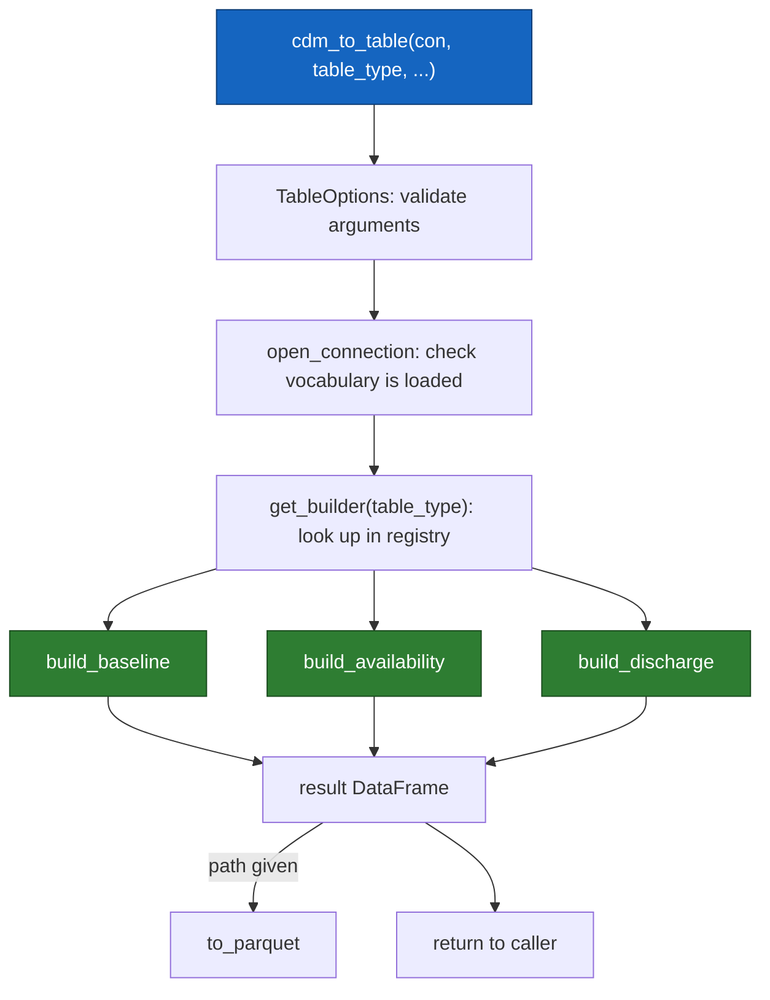
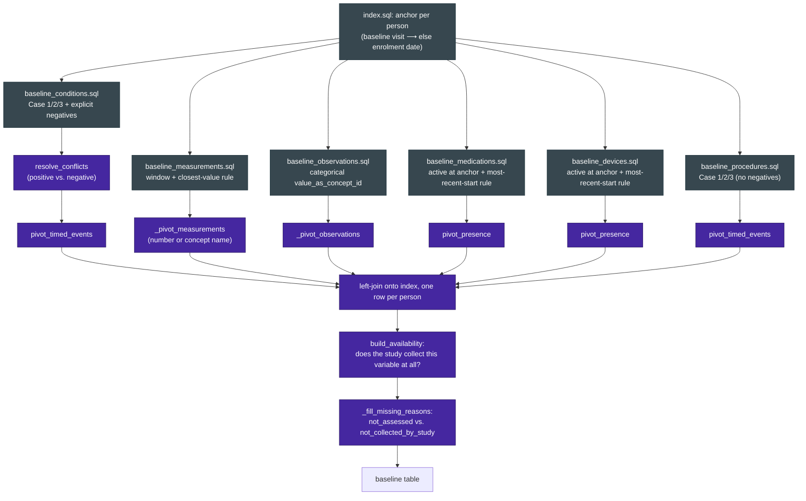
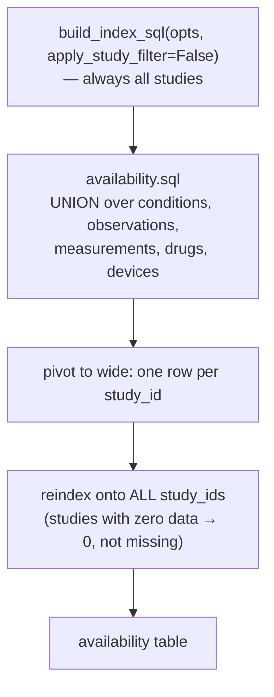
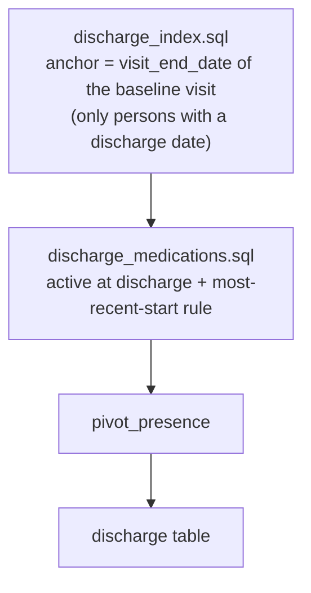
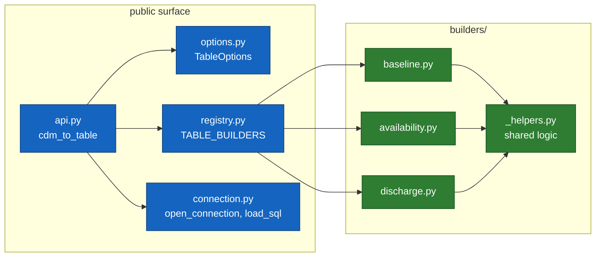

# Analysis Table Generation (`afbstepomop.analysis_tables`)

This document explains how `cdm_to_table()` turns a populated AFBSTEP OMOP
CDM database into ready-to-use analysis tables (baseline characteristics,
data availability, discharge medications). It is meant as a reference for
anyone extending the package with a new table type.

## Design principles

- **SQL-only, no side information.** Every table is derived purely from
  what is in the CDM database plus the arguments passed to `cdm_to_table()`.
  Variable names and labels come from `concept.concept_name` (auto-discovery),
  never from a hardcoded list.
- **One shared anchor.** Baseline-oriented tables use the same anchor date
  per person: the visit marked by concept `2000013017` ("Baseline visit")
  if one exists, otherwise `person_study.enrollment_date`. This is computed
  once in `sql/index.sql` and reused everywhere.
- **Registry pattern.** Each table type is a builder function registered
  under a name in `registry.py`. Adding a table type never requires
  touching `api.py`, `options.py`, or `connection.py`.
- **Shared building blocks live in `builders/_helpers.py`.** Anything used
  by more than one table type (index SQL, variable filtering, conflict
  resolution, generic pivoting) is defined once there.

## Overview: how a call flows through the package

## `baseline`: six domains, one anchor

## `availability`: studies × variables, always unfiltered by `studies`

## `discharge`: a separate anchor

**Why `discharge` is a separate table, not part of `baseline`:** a
"baseline" characteristic must exist before treatment can have caused it.
Discharge medications can themselves be a consequence of what happened
during the admission (e.g. a beta-blocker started because of a new HF
diagnosis) — including them in the baseline table would risk adjusting
for a mediator. See the design discussion in [chat/commit reference] for
the full reasoning.

## Module structure

## Conventions used throughout

| Convention | Value | Defined in |
|---|---|---|
| Unknown historical date (comorbidity Case 3) | `1900-01-01` | `conventions.SENTINEL_UNKNOWN_DATE` |
| Ongoing exposure | `2099-12-31` or empty end date | `conventions.SENTINEL_ONGOING_DATE` |
| Explicit negative finding | `4189457` | `conventions.NEGATIVE_CONCEPT_ID` |
| Baseline visit marker | `2000013017` | `conventions.BASELINE_VISIT_CONCEPT_ID` |
| Field concept for `visit_occurrence.visit_occurrence_id` | `1147869` | `sql/index.sql`, `sql/discharge_index.sql` |

## Adding a new table type

1. Write the SQL file(s) under `sql/`.
2. Write a `builders/<name>.py` with a `build_<name>(connection, opts)`
   function returning a `pandas.DataFrame`. Reuse `builders/_helpers.py`
   wherever the logic is generic (index anchor, variable filtering,
   conflict resolution, pivoting).
3. Register it in `registry.py`: `TABLE_BUILDERS["<name>"] = build_<name>`.
4. Add a fixture-based test suite under `tests/analysis_tables/`.

No change to `api.py`, `options.py`, or `connection.py` is required.

## Known limitations / deferred work

- `study_missingness_design.csv` is loaded but not yet consulted — it is
  meant to distinguish studies whose protocol cannot record explicit
  negative findings, once populated with real studies.
- Overlapping medication/device rows resolve via "most recent start
  wins"; no explicit handling of genuinely simultaneous, non-overlapping
  courses of the same drug.
- Conflict detection (positive vs. negative finding for the same
  person/variable) should eventually also be flagged by the output
  validator at data-loading time, not only resolved here at read time.